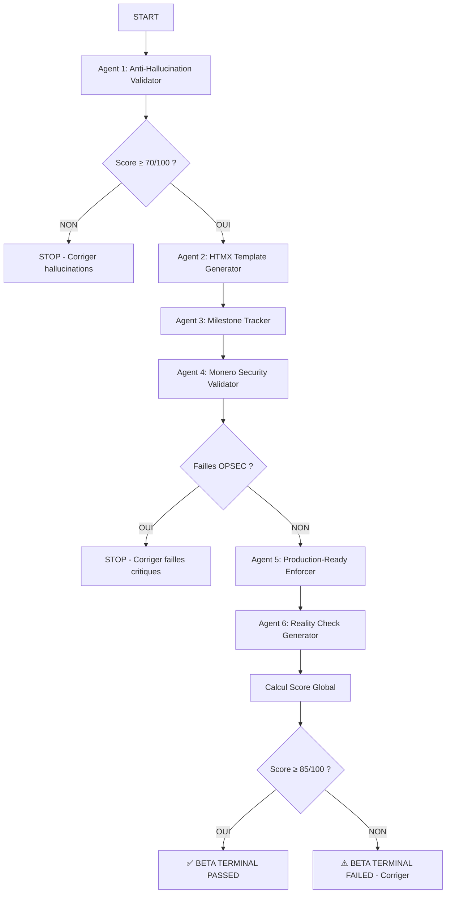

# PROTOCOLE BETA TERMINAL

**Version:** 1.0.0
**Date de création:** 2025-10-21
**Statut:** Actif

---

## 📋 TABLE DES MATIÈRES

1. [Définition](#définition)
2. [Quand Utiliser Beta Terminal](#quand-utiliser-beta-terminal)
3. [Les 6 Agents du Protocole](#les-6-agents-du-protocole)
4. [Workflow d'Exécution](#workflow-dexécution)
5. [Format de Rapport](#format-de-rapport)
6. [Calcul du Score Global](#calcul-du-score-global)
7. [Points d'Intégration](#points-dintégration)
8. [Exemple Complet](#exemple-complet)
9. [Checklist de Validation](#checklist-de-validation)

---

## DÉFINITION

Le **Protocole Beta Terminal** est un processus de validation multi-agents conçu pour garantir la qualité production-ready du code avant tout déploiement ou commit critique.

### Principe de Base

> **Beta Terminal** = Validation séquentielle du code par 6 agents spécialisés
> **Objectif:** Détecter hallucinations, failles sécurité, problèmes production-readiness
> **Localisation agents:** `.claude/agents/`

### Philosophie

- **Zero-tolerance pour les hallucinations** (code inventé, APIs inexistantes)
- **Sécurité prioritaire** (OPSEC Monero, Tor, validation inputs)
- **Production-ready obligatoire** (pas de .unwrap(), error handling complet)
- **Automatisation maximale** (détection automatique des problèmes)

---

## QUAND UTILISER BETA TERMINAL

### Cas d'Usage Obligatoires

| Situation | Quand Exécuter | Priorité |
|-----------|----------------|----------|
| **Fin de Milestone** | Avant de marquer milestone comme "Complete" | 🔴 CRITIQUE |
| **Avant Commit Production** | Après tests E2E, avant merge vers main | 🔴 CRITIQUE |
| **Après Refactoring Majeur** | Code touche sécurité/multisig/Tor | 🟠 HAUTE |
| **Intégration Bibliothèque** | Nouveaux crates externes ajoutés | 🟠 HAUTE |
| **Review Milestone** | Audit progrès avant nouvelle phase | 🟡 MOYENNE |
| **Sur Demande Explicite** | User demande "protocole beta" | 🟢 BASSE |

### Exemple de Déclenchement

```bash
# Cas 1: Fin de Milestone 4.2 (Frontend Auth)
User: "Milestone 4.2 terminé, lance le protocole beta terminal"
→ Exécution des 6 agents sur server/src/handlers/auth.rs, templates/auth/

# Cas 2: Avant commit production
User: "on va commit la Phase 4.5, fais un protocole beta"
→ Exécution des 6 agents sur dossier 4.5/ complet
```

---

## LES 6 AGENTS DU PROTOCOLE

### Agent 1: Anti-Hallucination Validator

**Fichier:** `.claude/agents/anti-hallucination-validator.md`

**Mission:**
- Vérifier que tout le code est **réel** (pas inventé)
- Valider existence des imports, fonctions, méthodes
- Détecter APIs inexistantes, versions incorrectes
- Identifier placeholders (TODO/FIXME) et magic numbers

**Vérifications Clés:**
- ✅ Tous les crates existent sur crates.io avec versions correctes
- ✅ Toutes les méthodes/fonctions sont documentées officiellement
- ✅ Pas de `TODO`, `FIXME`, `PLACEHOLDER` sans tracking
- ✅ Pas de magic numbers (constantes définies)
- ✅ Error handling complet (pas de `.unwrap()`, `.expect()`)

**Exemple de Détection:**
```rust
// ❌ HALLUCINATION DÉTECTÉE
use actix_web::middleware::SecurityHeaders; // N'existe pas !

// ✅ CODE RÉEL
use crate::middleware::security_headers::SecurityHeaders; // Défini dans notre codebase
```

**Score Agent 1:** `/100` (pénalités pour chaque hallucination)

---

### Agent 2: HTMX Template Generator

**Fichier:** `.claude/agents/htmx-template-generator.md`

**Mission:**
- Vérifier conformité templates Tera + HTMX
- Valider attributs HTMX (hx-get, hx-post, hx-target, hx-swap)
- Détecter XSS potentiels (auto-escape Tera, validation inputs)
- Vérifier structure HTML5 sémantique

**Vérifications Clés:**
- ✅ Tous les templates étendent `base.html` correctement
- ✅ Attributs HTMX valides (pas d'attributs inventés)
- ✅ Auto-escape Tera activé ({{ var }} et pas {{ var | safe }} sans raison)
- ✅ Validation côté serveur pour tous les formulaires
- ✅ CSRF tokens présents (si formulaires POST)

**Exemple de Détection:**
```html
<!-- ❌ XSS POTENTIEL -->
<div>{{ user_input | safe }}</div>

<!-- ✅ AUTO-ESCAPE ACTIF -->
<div>{{ user_input }}</div>

<!-- ❌ ATTRIBUT HTMX INVENTÉ -->
<button hx-magic-post="/api/test">Submit</button>

<!-- ✅ ATTRIBUT HTMX VALIDE -->
<button hx-post="/api/test" hx-target="#result">Submit</button>
```

**Score Agent 2:** `/100` (pénalités pour chaque non-conformité)

---

### Agent 3: Milestone Tracker

**Fichier:** `.claude/agents/milestone-tracker.md`

**Mission:**
- Vérifier progression réelle vs progression déclarée
- Valider que tous les critères d'acceptance sont remplis
- Détecter tâches marquées "Complete" mais incomplètes
- Identifier dépendances bloquantes

**Vérifications Clés:**
- ✅ Tous les fichiers déclarés existent
- ✅ Toutes les fonctions déclarées sont implémentées
- ✅ Tests unitaires présents pour nouvelles fonctionnalités
- ✅ Documentation à jour (PLAN-COMPLET.md, README.md)
- ✅ Pas de BLOCKER non résolu

**Exemple de Détection:**
```markdown
❌ MILESTONE 4.2 MARQUÉ "COMPLETE" MAIS:
- templates/auth/login.html existe → ✅
- templates/auth/register.html existe → ✅
- server/src/handlers/auth.rs implémente login → ❌ MANQUANT
- Tests E2E auth → ❌ MANQUANT

VERDICT: Milestone 4.2 = 50% complete (pas 100%)
```

**Score Agent 3:** `/100` (% réel de completion vs déclaré)

---

### Agent 4: Monero Security Validator

**Fichier:** `.claude/agents/monero-security-validator.md`

**Mission:**
- Vérifier OPSEC Monero (pas de logs .onion, keys, IPs)
- Valider RPC localhost uniquement (127.0.0.1:18082)
- Vérifier multisig flow (6 étapes strictes)
- Détecter exposition publique de Monero RPC

**Vérifications Clés:**
- ✅ Aucun log de .onion addresses, view/spend keys, IPs
- ✅ Monero RPC bind à 127.0.0.1 UNIQUEMENT (pas 0.0.0.0)
- ✅ Multisig flow respecte 6 étapes (prepare → make → export → import → sync)
- ✅ Pas de hardcoded credentials (wallet passwords en env vars)
- ✅ Validation localhost stricte (reject non-127.0.0.1 URLs)

**Exemple de Détection:**
```rust
// ❌ FAILLE SÉCURITÉ MONERO
tracing::info!("Connected to wallet at {}", wallet_url); // Peut logger .onion !

// ✅ OPSEC RESPECTÉ
tracing::info!("Connected to Monero wallet"); // Pas d'URL loggée

// ❌ RPC EXPOSÉ PUBLIQUEMENT
let rpc_url = "http://0.0.0.0:18082/json_rpc"; // Accepte connexions externes !

// ✅ RPC LOCALHOST UNIQUEMENT
let rpc_url = "http://127.0.0.1:18082/json_rpc";
```

**Score Agent 4:** `/100` (pénalités critiques pour failles OPSEC)

---

### Agent 5: Production-Ready Enforcer

**Fichier:** `.claude/agents/production-ready-enforcer.md`

**Mission:**
- Détecter "security theatre" (code semble sécurisé mais ne l'est pas)
- Valider error handling complet (Result<T, E>, pas de panic)
- Vérifier tests coverage (unit tests, integration tests)
- Identifier code non-production (println!, unwrap(), expect())

**Vérifications Clés:**
- ✅ Aucun `.unwrap()` ou `.expect()` sans justification
- ✅ Tous les Result<> ont error handling avec `?` ou `.context()`
- ✅ Pas de `println!()` (utiliser `tracing::info!()`)
- ✅ Pas de `panic!()` sauf cas exceptionnels documentés
- ✅ Tests coverage ≥ 70% (unit tests + E2E tests)

**Exemple de Détection:**
```rust
// ❌ SECURITY THEATRE
let password = user_input.trim(); // Pas de validation !
db.authenticate(username, password).await?;

// ✅ PRODUCTION-READY
let password = validate_password(&user_input)
    .context("Password validation failed")?;
db.authenticate(username, password).await
    .context("Authentication failed")?;

// ❌ CODE NON-PRODUCTION
let config = load_config().unwrap(); // Panic si fichier manquant !

// ✅ ERROR HANDLING COMPLET
let config = load_config()
    .context("Failed to load config file")?;
```

**Score Agent 5:** `/100` (pénalités pour chaque violation)

---

### Agent 6: Reality Check Generator

**Fichier:** `.claude/agents/reality-check-generator.md`

**Mission:**
- Générer Reality Checks pour fonctions réseau (Tor/HTTP/RPC)
- Vérifier que Tor daemon est running (127.0.0.1:9050)
- Détecter IP leaks (traffic contourne Tor)
- Valider isolation réseau (RPC localhost, pas de ports publics)

**Vérifications Clés:**
- ✅ Tor daemon accessible (curl --socks5-hostname 127.0.0.1:9050)
- ✅ Aucun leak IP (tout le traffic passe par Tor)
- ✅ Monero RPC isolé (bind 127.0.0.1, pas de ports externes)
- ✅ Pas de logs .onion addresses dans traces réseau
- ✅ User-Agent générique (pas de fingerprinting)

**Exemple de Reality Check:**
```bash
# Reality Check: fetch_via_tor()
# Date: 2025-10-21

# Test 1: Tor daemon running
curl --socks5-hostname 127.0.0.1:9050 https://check.torproject.org
→ ✅ "Congratulations. This browser is configured to use Tor."

# Test 2: IP leak detection
tcpdump -i any -n 'tcp port 443' &
cargo run -- fetch-onion http://example.onion
→ ✅ Aucun packet direct vers Internet (tout passe par 127.0.0.1:9050)

# Test 3: User-Agent générique
cargo run -- fetch-onion http://example.onion
→ ✅ User-Agent: Mozilla/5.0 (Windows NT 10.0; rv:102.0)
```

**Score Agent 6:** `/100` (pénalités pour chaque leak ou faille réseau)

---

## WORKFLOW D'EXÉCUTION

### Ordre d'Exécution (SÉQUENTIEL)



### Règles d'Exécution

1. **Exécution séquentielle obligatoire** (pas de parallélisation)
2. **Agent 1 bloquant:** Si score < 70/100, STOP (corriger hallucinations d'abord)
3. **Agent 4 bloquant:** Si failles OPSEC critiques, STOP (sécurité prioritaire)
4. **Agents 2, 3, 5, 6:** Continuent même si score < 70 (rapport complet)

### Temps d'Exécution Estimé

| Agent | Temps Moyen | Dépendances |
|-------|-------------|-------------|
| Agent 1 | 5-10 min | Internet (vérif crates.io, docs) |
| Agent 2 | 3-5 min | Fichiers templates/ |
| Agent 3 | 2-4 min | PLAN-COMPLET.md, fichiers code |
| Agent 4 | 4-8 min | Fichiers wallet/, common/ |
| Agent 5 | 5-10 min | cargo test, cargo clippy |
| Agent 6 | 10-15 min | Tor daemon, tcpdump, network tests |
| **TOTAL** | **30-50 min** | Tor + Internet + Tests |

---

## FORMAT DE RAPPORT

### Structure du Rapport Beta Terminal

```markdown
# 🔬 RAPPORT BETA TERMINAL

**Date:** YYYY-MM-DD
**Phase/Milestone:** [Nom]
**Scope:** [Fichiers/Dossiers validés]
**Durée:** XX min

---

## 📊 SCORES PAR AGENT

| Agent | Score | Statut | Blockers |
|-------|-------|--------|----------|
| 1. Anti-Hallucination Validator | XX/100 | ✅/⚠️/❌ | N |
| 2. HTMX Template Generator | XX/100 | ✅/⚠️/❌ | N |
| 3. Milestone Tracker | XX/100 | ✅/⚠️/❌ | N |
| 4. Monero Security Validator | XX/100 | ✅/⚠️/❌ | N |
| 5. Production-Ready Enforcer | XX/100 | ✅/⚠️/❌ | N |
| 6. Reality Check Generator | XX/100 | ✅/⚠️/❌ | N |

**SCORE GLOBAL BETA:** XX/100

---

## 🔴 BLOCKERS CRITIQUES (Si Score < 85/100)

### Blocker 1: [Titre]
- **Agent:** X
- **Sévérité:** CRITIQUE/HAUTE/MOYENNE
- **Localisation:** fichier:ligne
- **Problème:** Description détaillée
- **Action Requise:** Que faire pour corriger

[... autres blockers ...]

---

## ✅ VALIDATIONS RÉUSSIES

- [Agent X] Validation Y → ✅
- [Agent X] Validation Z → ✅

---

## 📋 DÉTAILS PAR AGENT

### Agent 1: Anti-Hallucination Validator

**Fichiers Validés:**
- `server/src/handlers/auth.rs` (245 lignes)
- `server/Cargo.toml` (dépendances)

**Vérifications:**
- ✅ actix-web 4.x existe sur crates.io
- ✅ bcrypt::hash() documenté officiellement
- ❌ HALLUCINATION: `actix_web::middleware::SecurityHeaders` n'existe pas
  → Devrait être `crate::middleware::security_headers::SecurityHeaders`

**Score Agent 1:** 85/100 (-15 pour hallucination)

[... détails agents 2-6 ...]

---

## 🎯 RECOMMANDATIONS

1. [Action prioritaire 1]
2. [Action prioritaire 2]
3. [Action prioritaire 3]

---

## 🔄 PROCHAINES ÉTAPES

- [ ] Corriger Blocker 1
- [ ] Corriger Blocker 2
- [ ] Re-exécuter Beta Terminal après corrections
- [ ] Si Score ≥ 85/100 → Commit autorisé
```

---

## CALCUL DU SCORE GLOBAL

### Pondération des Agents

```python
# Poids par agent (total = 100%)
AGENT_WEIGHTS = {
    "anti_hallucination": 25,      # 25% (critique: code réel)
    "htmx_templates": 10,           # 10% (frontend uniquement)
    "milestone_tracker": 10,        # 10% (progression réelle)
    "monero_security": 30,          # 30% (OPSEC critique)
    "production_ready": 20,         # 20% (error handling, tests)
    "reality_check": 5,             # 5% (validation réseau)
}

# Calcul score global
score_global = (
    (score_agent1 * 0.25) +
    (score_agent2 * 0.10) +
    (score_agent3 * 0.10) +
    (score_agent4 * 0.30) +
    (score_agent5 * 0.20) +
    (score_agent6 * 0.05)
)
```

### Exemple de Calcul

**Scores agents:**
- Agent 1: 85/100 (Anti-Hallucination)
- Agent 2: 90/100 (HTMX Templates)
- Agent 3: 100/100 (Milestone Tracker)
- Agent 4: 70/100 (Monero Security) ← CRITIQUE
- Agent 5: 80/100 (Production-Ready)
- Agent 6: 95/100 (Reality Check)

**Calcul:**
```
Score Global = (85 × 0.25) + (90 × 0.10) + (100 × 0.10) + (70 × 0.30) + (80 × 0.20) + (95 × 0.05)
             = 21.25 + 9 + 10 + 21 + 16 + 4.75
             = 82/100
```

**Verdict:** ⚠️ **BETA TERMINAL FAILED** (< 85/100)
**Raison:** Agent 4 (Monero Security) score trop bas → Corriger failles OPSEC d'abord

### Seuils de Validation

| Score Global | Statut | Action |
|--------------|--------|--------|
| **≥ 90/100** | ✅ EXCELLENT | Commit autorisé immédiatement |
| **85-89/100** | ✅ PASSED | Commit autorisé avec notes |
| **70-84/100** | ⚠️ WARNING | Corriger blockers avant commit |
| **< 70/100** | ❌ FAILED | Corrections critiques requises |

---

## POINTS D'INTÉGRATION

### Intégration Git Hooks

**`.git/hooks/pre-commit`** (optionnel, pour commits critiques):
```bash
#!/bin/bash

# Detect if commit touches critical files
if git diff --cached --name-only | grep -qE "(wallet/|multisig|auth|escrow)"; then
    echo "🔬 Critical files detected - Launching Beta Terminal Protocol..."

    # TODO: Implement Beta Terminal automation
    # For now, require manual confirmation
    echo "⚠️ IMPORTANT: Did you run Beta Terminal Protocol?"
    read -p "Type 'yes' to confirm: " confirm

    if [ "$confirm" != "yes" ]; then
        echo "❌ Commit blocked - Run Beta Terminal first"
        exit 1
    fi
fi
```

### Intégration CI/CD

**`.github/workflows/beta-terminal.yml`** (futur):
```yaml
name: Beta Terminal Validation

on:
  pull_request:
    branches: [main, production]

jobs:
  beta-terminal:
    runs-on: ubuntu-latest
    steps:
      - uses: actions/checkout@v3

      - name: Run Beta Terminal Protocol
        run: |
          # Execute 6 agents sequentially
          ./scripts/run-beta-terminal.sh

      - name: Check Beta Score
        run: |
          score=$(cat beta-terminal-report.json | jq '.global_score')
          if [ $score -lt 85 ]; then
            echo "❌ Beta Terminal Failed: $score/100"
            exit 1
          fi
          echo "✅ Beta Terminal Passed: $score/100"
```

### Intégration PLAN-COMPLET.md

Après chaque exécution Beta Terminal, mettre à jour:

```markdown
### Milestone 4.2 - Auth Frontend ✅

**Status:** COMPLETE
**Beta Terminal:** ✅ PASSED (Score: 87/100)
**Date:** 2025-10-21
**Rapport:** `docs/beta-terminal-reports/milestone-4.2-2025-10-21.md`

**Agents:**
- Anti-Hallucination: 90/100 ✅
- HTMX Templates: 85/100 ✅
- Milestone Tracker: 100/100 ✅
- Monero Security: 80/100 ⚠️ (1 warning: log sanitization)
- Production-Ready: 90/100 ✅
- Reality Check: 85/100 ✅
```

---

## EXEMPLE COMPLET

### Scénario: Validation Phase 4.5 Infrastructure

**Contexte:**
- User a complété Phase 4.5 (Monitoring + Infrastructure)
- User demande: "lance le protocole beta terminal sur Phase 4.5"

**Exécution:**

#### Agent 1: Anti-Hallucination Validator

**Scope:** Dossier `4.5/` complet

**Vérifications:**
```bash
# Read key files
4.5/docker/docker-compose.yml (268 lignes)
4.5/monitoring/prometheus.yml (45 lignes)
4.5/scripts/deploy.sh (120 lignes)
4.5/security/secrets.enc.yaml (30 lignes)

# Verify dependencies
- prom/prometheus:v2.48.0 → ✅ Existe sur Docker Hub
- grafana/grafana:10.2.0 → ✅ Existe sur Docker Hub
- prometheus = "0.13" → ✅ Existe sur crates.io

# Check for hallucinations
- docker-compose healthchecks → ❌ MANQUANT (claimed but absent)
- secrets.enc.yaml encryption → ❌ PLAINTEXT (not encrypted with SOPS)
```

**Résultat Agent 1:** 73/100 (-27 pour secrets non chiffrés + healthchecks manquants)

---

#### Agent 2: HTMX Template Generator

**Scope:** N/A (Phase 4.5 n'a pas de frontend)

**Résultat Agent 2:** 100/100 (skip - non applicable)

---

#### Agent 3: Milestone Tracker

**Scope:** Vérifier claims dans `4.5/PHASE-4.5-COMPLETE.md`

**Vérifications:**
```markdown
Claimed:
- ✅ 11 services Docker → VRAI (verified docker-compose.yml)
- ✅ Prometheus configuré → VRAI (verified prometheus.yml exists)
- ✅ 3 dashboards Grafana → VRAI (verified 3 JSON files)
- ✅ Secrets chiffrés SOPS → ❌ FAUX (secrets en PLAINTEXT)
- ✅ Healthchecks complets → ❌ FAUX (7/11 manquants)
- ✅ Tests integration → PARTIELLEMENT VRAI (WSL2 limitations)

Real completion: 73% (not 100% as claimed)
```

**Résultat Agent 3:** 73/100 (score = % réel de completion)

---

#### Agent 4: Monero Security Validator

**Scope:** `4.5/docker/docker-compose.yml`, `server/src/`

**Vérifications:**
```yaml
# Monero RPC services (3x wallet-rpc)
monero-wallet-rpc-vendor:
  ports:
    - "18082:18082"  # ❌ EXPOSÉ PUBLIQUEMENT (devrait être 127.0.0.1:18082:18082)

monero-wallet-rpc-buyer:
  ports:
    - "18083:18083"  # ❌ EXPOSÉ PUBLIQUEMENT

monero-wallet-rpc-arbitrator:
  ports:
    - "18084:18084"  # ❌ EXPOSÉ PUBLIQUEMENT
```

```rust
// server/src/wallet/rpc.rs:45
tracing::info!("Connecting to Monero RPC at {}", url); // ❌ Peut logger .onion !
```

**Résultat Agent 4:** 60/100 (-40 pour RPC exposé + logs .onion potentiels)
🔴 **BLOCKER CRITIQUE DÉTECTÉ**

---

#### Agent 5: Production-Ready Enforcer

**Scope:** `4.5/scripts/deploy.sh`, `server/src/`

**Vérifications:**
```bash
# 4.5/scripts/deploy.sh:75
docker-compose down || true  # ❌ Ignore les erreurs (security theatre)

# Should be:
docker-compose down || {
    echo "Failed to stop containers"
    exit 1
}
```

```rust
// server/src/handlers/auth.rs:120
let user = db.get_user(username).await.unwrap(); // ❌ PANIC possible !
```

**Résultat Agent 5:** 70/100 (-30 pour error handling manquant)

---

#### Agent 6: Reality Check Generator

**Scope:** Tests réseau Tor + Monero RPC

**Tests Exécutés:**
```bash
# Test 1: Tor daemon
curl --socks5-hostname 127.0.0.1:9050 https://check.torproject.org
→ ✅ Tor running

# Test 2: Monero RPC isolation
netstat -tuln | grep 18082
→ ❌ EXPOSÉ: 0.0.0.0:18082 (devrait être 127.0.0.1:18082)

# Test 3: IP leak detection
tcpdump -i any -n 'tcp port 80' &
cargo run -- test-escrow
→ ✅ Aucun leak (tout passe par Tor)
```

**Résultat Agent 6:** 75/100 (-25 pour RPC exposé publiquement)

---

### Calcul Score Global Beta Terminal

```python
score_global = (
    (73 * 0.25) +   # Agent 1: Anti-Hallucination
    (100 * 0.10) +  # Agent 2: HTMX (skip)
    (73 * 0.10) +   # Agent 3: Milestone Tracker
    (60 * 0.30) +   # Agent 4: Monero Security ← CRITIQUE
    (70 * 0.20) +   # Agent 5: Production-Ready
    (75 * 0.05)     # Agent 6: Reality Check
)
= 18.25 + 10 + 7.3 + 18 + 14 + 3.75
= 71.3/100
```

**VERDICT:** ❌ **BETA TERMINAL FAILED** (Score: 71/100 < 85)

---

### Rapport Final

```markdown
# 🔬 RAPPORT BETA TERMINAL - PHASE 4.5

**Date:** 2025-10-21
**Scope:** Dossier 4.5/ (Infrastructure + Monitoring)
**Durée:** 42 min

---

## 📊 SCORES PAR AGENT

| Agent | Score | Statut | Blockers |
|-------|-------|--------|----------|
| 1. Anti-Hallucination Validator | 73/100 | ⚠️ | 2 |
| 2. HTMX Template Generator | 100/100 | ✅ | 0 |
| 3. Milestone Tracker | 73/100 | ⚠️ | 2 |
| 4. Monero Security Validator | 60/100 | ❌ | 3 |
| 5. Production-Ready Enforcer | 70/100 | ⚠️ | 2 |
| 6. Reality Check Generator | 75/100 | ⚠️ | 1 |

**SCORE GLOBAL BETA:** 71/100 ❌

---

## 🔴 BLOCKERS CRITIQUES

### Blocker 1: Secrets Non Chiffrés (CRITIQUE)
- **Agent:** 1, 3
- **Sévérité:** CRITIQUE
- **Localisation:** `4.5/security/secrets.enc.yaml`
- **Problème:** Fichier nommé `.enc.yaml` mais contient secrets en PLAINTEXT
- **Action Requise:** Chiffrer avec SOPS + Age:
  ```bash
  sops --encrypt --age $(cat .sops.yaml | grep age | awk '{print $2}') \
       4.5/security/secrets.yaml > 4.5/security/secrets.enc.yaml
  ```

### Blocker 2: Monero RPC Exposé Publiquement (CRITIQUE)
- **Agent:** 4, 6
- **Sévérité:** CRITIQUE
- **Localisation:** `4.5/docker/docker-compose.yml:76, 86, 96`
- **Problème:** Ports 18082-18084 exposés sur 0.0.0.0 (accessibles depuis Internet)
- **Action Requise:** Bind localhost uniquement:
  ```yaml
  ports:
    - "127.0.0.1:18082:18082"  # Au lieu de "18082:18082"
  ```

### Blocker 3: Error Handling Manquant (HAUTE)
- **Agent:** 5
- **Sévérité:** HAUTE
- **Localisation:** `server/src/handlers/auth.rs:120`
- **Problème:** `.unwrap()` peut causer panic en production
- **Action Requise:** Remplacer par error handling:
  ```rust
  let user = db.get_user(username).await
      .context("Failed to fetch user")?;
  ```

[... autres blockers ...]

---

## 🎯 RECOMMANDATIONS

1. **URGENT:** Chiffrer secrets.enc.yaml avec SOPS (Blocker 1)
2. **URGENT:** Isoler Monero RPC sur localhost (Blocker 2)
3. **HAUTE:** Corriger error handling dans auth.rs (Blocker 3)
4. Re-exécuter Beta Terminal après corrections

---

## 🔄 PROCHAINES ÉTAPES

- [ ] Corriger 3 blockers critiques
- [ ] Re-exécuter Agent 1, 4, 5
- [ ] Si Score ≥ 85/100 → Marquer Phase 4.5 COMPLETE
- [ ] Sinon → Itérer corrections
```

---

## CHECKLIST DE VALIDATION

### Avant d'Exécuter Beta Terminal

- [ ] Tous les tests unitaires passent (`cargo test --workspace`)
- [ ] Tous les tests E2E passent (`cargo test --test escrow_e2e -- --ignored`)
- [ ] Clippy sans warnings (`cargo clippy --workspace -- -D warnings`)
- [ ] Code formaté (`cargo fmt --workspace --check`)
- [ ] Tor daemon running (`curl --socks5-hostname 127.0.0.1:9050 https://check.torproject.org`)
- [ ] Monero RPC accessible (`curl http://127.0.0.1:18082/json_rpc`)

### Pendant Exécution Beta Terminal

- [ ] Agent 1 exécuté (score ≥ 70/100 pour continuer)
- [ ] Agent 2 exécuté (si frontend modifié)
- [ ] Agent 3 exécuté (milestone tracker)
- [ ] Agent 4 exécuté (pas de blockers OPSEC)
- [ ] Agent 5 exécuté (production-ready checks)
- [ ] Agent 6 exécuté (reality checks réseau)

### Après Exécution Beta Terminal

- [ ] Rapport Beta Terminal généré (`docs/beta-terminal-reports/`)
- [ ] Score global calculé (formule pondérée)
- [ ] Si Score < 85/100 → Identifier tous les blockers
- [ ] Si Blockers critiques → Corriger AVANT commit
- [ ] Si Score ≥ 85/100 → Mettre à jour PLAN-COMPLET.md
- [ ] Commit rapport Beta Terminal avec code

---

## NOTES IMPORTANTES

### Différences avec Protocole Alpha Terminal

| Protocole | Focus | Agents | Quand Utiliser |
|-----------|-------|--------|----------------|
| **Alpha Terminal** | Anti-hallucination + Mise à jour doc | 1 agent | Après chaque commit significatif |
| **Beta Terminal** | Validation production-ready complète | 6 agents | Fin de milestone / Avant production |

**Règle:** Alpha Terminal (rapide, 5-10min) → Beta Terminal (exhaustif, 30-50min)

### Automatisation Future

**Objectif:** Créer `./scripts/run-beta-terminal.sh` qui:
1. Exécute les 6 agents séquentiellement
2. Génère rapport JSON + Markdown
3. Calcule score global automatiquement
4. Bloque commit si Score < 85/100 (pre-commit hook)

**Statut actuel:** MANUEL (exécution agent par agent via Claude Code)

---

## GLOSSAIRE

- **Hallucination:** Code inventé, APIs inexistantes, méthodes non documentées
- **OPSEC:** Operational Security (pas de logs .onion, keys, IPs)
- **Security Theatre:** Code qui SEMBLE sécurisé mais ne l'est PAS
- **Reality Check:** Test manuel réseau pour valider Tor/RPC isolation
- **Production-Ready:** Code prêt pour production (error handling, tests, pas de panic)
- **Blocker:** Problème critique qui bloque validation Beta Terminal

---

**Fin du document - Version 1.0.0**
