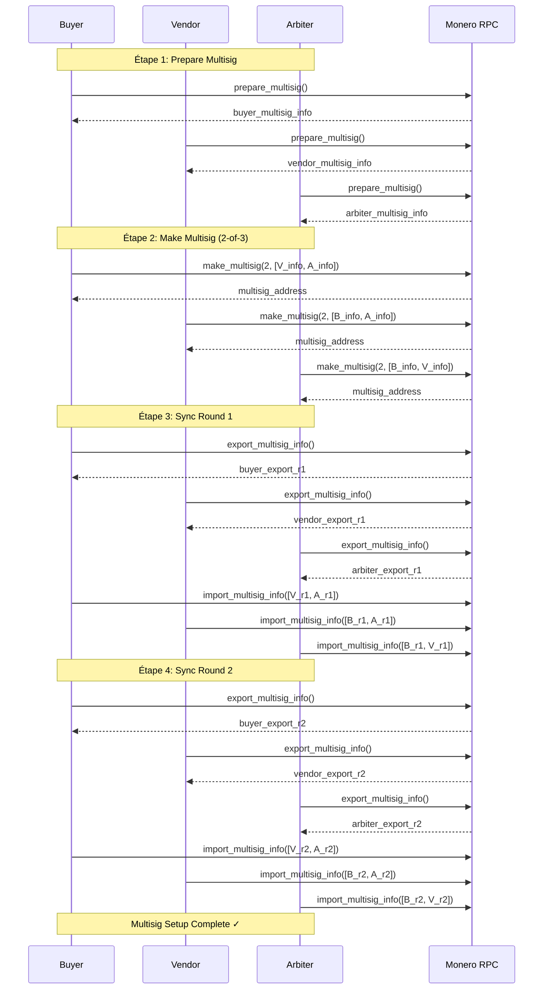

# Phase 1: Complétion du Multisig Core
## Plan d'Implémentation Détaillé

**Durée:** 4-6 semaines
**Priorité:** CRITIQUE
**Statut:** 🚀 NEXT UP
**Date de Début:** 2025-10-16

---

## Objectif Principal

Rendre le workflow multisig 2-of-3 **entièrement fonctionnel, testé et documenté** avec Reality Checks validés pour chaque fonction réseau.

**Success Criteria:**
- ✅ 3 wallets testnet peuvent créer un multisig 2-of-3 sans erreur
- ✅ Transactions peuvent être créées, signées et diffusées
- ✅ Code coverage >80% pour `wallet/`
- ✅ Zero `.unwrap()` ou `panic!` possibles
- ✅ Tous les Reality Checks Tor validés
- ✅ Tests end-to-end passent automatiquement

---

## Milestone 1.1: Tests End-to-End (Semaine 1-2)

### Task 1.1.1: Setup Automatique de 3 Wallets Testnet
**Durée:** 2 jours
**Assigné:** À définir
**Priorité:** Haute

**Objectif:** Script PowerShell qui créé 3 wallets testnet prêts pour multisig.

**Délivrables:**
```powershell
# scripts/setup-3-wallets-testnet.ps1
```

**Spécification:**
```powershell
# 1. Vérifier Monero daemon testnet running
# 2. Créer 3 wallets:
#    - wallet-buyer.testnet
#    - wallet-vendor.testnet
#    - wallet-arbiter.testnet
# 3. Chaque wallet bind sur port différent:
#    - Buyer: 18082
#    - Vendor: 18083
#    - Arbiter: 18084
# 4. Générer fichiers de config pour chaque
# 5. Démarrer les 3 wallet-rpc simultanément
# 6. Attendre que les 3 soient prêts (health check)
# 7. Output: 3 URLs RPC + passwords
```

**Fichiers à Créer:**
- `scripts/setup-3-wallets-testnet.ps1`
- `docs/specs/setup_3_wallets.md`

**Tests de Validation:**
```powershell
# Après script, vérifier:
PS> Get-Process monero-wallet-rpc | Measure-Object # Doit retourner 3

PS> Invoke-RestMethod -Uri "http://127.0.0.1:18082/json_rpc" -Method Post -Body '{"jsonrpc":"2.0","id":"0","method":"get_version"}'
# Doit retourner version

PS> Invoke-RestMethod -Uri "http://127.0.0.1:18083/json_rpc" -Method Post -Body '{"jsonrpc":"2.0","id":"0","method":"get_version"}'
# Doit retourner version

PS> Invoke-RestMethod -Uri "http://127.0.0.1:18084/json_rpc" -Method Post -Body '{"jsonrpc":"2.0","id":"0","method":"get_version"}'
# Doit retourner version
```

**Acceptance Criteria:**
- [ ] Script s'exécute sans erreur
- [ ] 3 wallets créés et running
- [ ] Health check passe pour les 3
- [ ] Temps d'exécution <2 minutes
- [ ] Documentation complète

---

### Task 1.1.2: Test End-to-End Multisig Setup
**Durée:** 3 jours
**Priorité:** Critique

**Objectif:** Test Rust qui orchestre le setup multisig complet avec 3 parties.

**Fichier:** `wallet/tests/multisig_e2e.rs`

**Structure du Test:**
```rust
#[tokio::test]
async fn test_full_multisig_2of3_setup() -> Result<()> {
    // Setup: 3 RPC clients
    let buyer = MoneroClient::new(MoneroConfig {
        rpc_url: "http://127.0.0.1:18082/json_rpc".to_string(),
        // ...
    })?;

    let vendor = MoneroClient::new(MoneroConfig {
        rpc_url: "http://127.0.0.1:18083/json_rpc".to_string(),
        // ...
    })?;

    let arbiter = MoneroClient::new(MoneroConfig {
        rpc_url: "http://127.0.0.1:18084/json_rpc".to_string(),
        // ...
    })?;

    // Étape 1: Prepare multisig (3 parties en parallèle)
    let (buyer_info, vendor_info, arbiter_info) = tokio::try_join!(
        buyer.multisig().prepare_multisig(),
        vendor.multisig().prepare_multisig(),
        arbiter.multisig().prepare_multisig()
    )?;

    info!("✓ Prepare multisig completed for all 3 parties");

    // Étape 2: Make multisig (chaque partie reçoit infos des 2 autres)
    let buyer_make = buyer.multisig().make_multisig(
        2, // threshold
        vec![vendor_info.multisig_info.clone(), arbiter_info.multisig_info.clone()]
    );

    let vendor_make = vendor.multisig().make_multisig(
        2,
        vec![buyer_info.multisig_info.clone(), arbiter_info.multisig_info.clone()]
    );

    let arbiter_make = arbiter.multisig().make_multisig(
        2,
        vec![buyer_info.multisig_info.clone(), vendor_info.multisig_info.clone()]
    );

    let (buyer_result, vendor_result, arbiter_result) = tokio::try_join!(
        buyer_make,
        vendor_make,
        arbiter_make
    )?;

    // Vérifier que les 3 ont la même adresse multisig
    assert_eq!(buyer_result.address, vendor_result.address);
    assert_eq!(buyer_result.address, arbiter_result.address);

    let multisig_address = buyer_result.address.clone();
    info!("✓ Multisig wallet created: {}", multisig_address);

    // Étape 3: Sync Round 1
    // Chaque partie exporte ses infos
    let (buyer_export_r1, vendor_export_r1, arbiter_export_r1) = tokio::try_join!(
        buyer.multisig().export_multisig_info(),
        vendor.multisig().export_multisig_info(),
        arbiter.multisig().export_multisig_info()
    )?;

    // Chaque partie importe les infos des 2 autres
    let buyer_import_r1 = buyer.multisig().import_multisig_info(vec![
        vendor_export_r1.info.clone(),
        arbiter_export_r1.info.clone()
    ]);

    let vendor_import_r1 = vendor.multisig().import_multisig_info(vec![
        buyer_export_r1.info.clone(),
        arbiter_export_r1.info.clone()
    ]);

    let arbiter_import_r1 = arbiter.multisig().import_multisig_info(vec![
        buyer_export_r1.info.clone(),
        vendor_export_r1.info.clone()
    ]);

    tokio::try_join!(buyer_import_r1, vendor_import_r1, arbiter_import_r1)?;
    info!("✓ Sync round 1 completed");

    // Étape 4: Sync Round 2
    let (buyer_export_r2, vendor_export_r2, arbiter_export_r2) = tokio::try_join!(
        buyer.multisig().export_multisig_info(),
        vendor.multisig().export_multisig_info(),
        arbiter.multisig().export_multisig_info()
    )?;

    let buyer_import_r2 = buyer.multisig().import_multisig_info(vec![
        vendor_export_r2.info.clone(),
        arbiter_export_r2.info.clone()
    ]);

    let vendor_import_r2 = vendor.multisig().import_multisig_info(vec![
        buyer_export_r2.info.clone(),
        arbiter_export_r2.info.clone()
    ]);

    let arbiter_import_r2 = arbiter.multisig().import_multisig_info(vec![
        buyer_export_r2.info.clone(),
        vendor_export_r2.info.clone()
    ]);

    tokio::try_join!(buyer_import_r2, vendor_import_r2, arbiter_import_r2)?;
    info!("✓ Sync round 2 completed");

    // Étape 5: Vérifier que tous sont prêts
    let (buyer_ready, vendor_ready, arbiter_ready) = tokio::try_join!(
        buyer.multisig().is_multisig(),
        vendor.multisig().is_multisig(),
        arbiter.multisig().is_multisig()
    )?;

    assert!(buyer_ready, "Buyer wallet should be multisig");
    assert!(vendor_ready, "Vendor wallet should be multisig");
    assert!(arbiter_ready, "Arbiter wallet should be multisig");

    info!("✓ All 3 parties are multisig-ready");
    info!("✓ Multisig address: {}", multisig_address);

    Ok(())
}
```

**Fichiers à Créer:**
- `wallet/tests/multisig_e2e.rs`
- `docs/specs/multisig_e2e_test.md`

**Reality Check:**
- Reality Check Tor pour ce test (vérifie isolation)

**Acceptance Criteria:**
- [ ] Test passe sans erreur
- [ ] Les 3 wallets ont la même adresse multisig
- [ ] `is_multisig()` retourne `true` pour les 3
- [ ] Temps d'exécution <5 minutes
- [ ] Logs clairs et compréhensibles

---

### Task 1.1.3: Diagramme de Séquence du Flow
**Durée:** 1 jour
**Priorité:** Moyenne

**Objectif:** Documentation visuelle du flow multisig.

**Fichier:** `docs/MULTISIG-SEQUENCE-DIAGRAM.md`

**Contenu:**


**Acceptance Criteria:**
- [ ] Diagramme rendu correctement dans GitHub/VS Code
- [ ] Toutes les étapes documentées
- [ ] Commentaires pour points critiques

---

## Milestone 1.2: Transactions Multisig (Semaine 3-4)

### Task 1.2.1: Implémenter `create_transaction()`
**Durée:** 2 jours
**Priorité:** Critique

**Objectif:** Créer une transaction multisig non signée.

**Fichier:** `wallet/src/multisig.rs`

**Signature:**
```rust
/// Create an unsigned multisig transaction
///
/// # Arguments
/// * `destinations` - Vec of (address, amount_atomic) tuples
/// * `priority` - Transaction priority (0=default, 1=low, 2=medium, 3=high)
///
/// # Returns
/// UnsignedTransaction containing tx_metadata for signing
///
/// # Errors
/// * `Error::InsufficientFunds` - Not enough balance
/// * `Error::InvalidAddress` - Destination address invalid
/// * `Error::MoneroRpc` - RPC error
pub async fn create_transaction(
    &self,
    destinations: Vec<(String, u64)>, // (address, amount_atomic)
    priority: u32,
) -> Result<UnsignedTransaction> {
    // TODO: Implement
}
```

**Types Requis:**
```rust
// common/src/types.rs
#[derive(Debug, Clone, Serialize, Deserialize)]
pub struct UnsignedTransaction {
    pub tx_metadata: String, // Hex-encoded metadata
    pub tx_hash: String,
    pub fee: u64, // atomic units
    pub total_amount: u64, // atomic units
}
```

**RPC Call:**
```json
{
  "jsonrpc": "2.0",
  "id": "0",
  "method": "transfer",
  "params": {
    "destinations": [{"amount": 1000000000000, "address": "..."}],
    "priority": 0,
    "do_not_relay": true,
    "get_tx_metadata": true
  }
}
```

**Spec à Créer:**
- `docs/specs/create_transaction.md`

**Reality Check:**
- `docs/reality-checks/tor-create_transaction-2025-10-XX.md`

**Tests:**
```rust
#[tokio::test]
async fn test_create_transaction() -> Result<()> {
    let client = setup_multisig_wallet().await?;

    let unsigned_tx = client.multisig().create_transaction(
        vec![("testnet-address-here".to_string(), 1_000_000_000_000)], // 1 XMR
        0 // default priority
    ).await?;

    assert!(!unsigned_tx.tx_metadata.is_empty());
    assert!(unsigned_tx.fee > 0);
    Ok(())
}
```

**Acceptance Criteria:**
- [ ] Fonction implémentée et testée
- [ ] Spec complète
- [ ] Reality Check validé
- [ ] Gestion d'erreur complète
- [ ] Documentation inline

---

### Task 1.2.2: Implémenter `sign_multisig_transaction()`
**Durée:** 2 jours
**Priorité:** Critique

**Signature:**
```rust
/// Sign a multisig transaction with this wallet's key
///
/// # Arguments
/// * `tx_metadata` - Unsigned transaction metadata (from create_transaction)
///
/// # Returns
/// SignedTransaction with signature for this wallet
pub async fn sign_multisig_transaction(
    &self,
    tx_metadata: String,
) -> Result<SignedTransaction> {
    // TODO: Implement
}
```

**Types:**
```rust
#[derive(Debug, Clone, Serialize, Deserialize)]
pub struct SignedTransaction {
    pub tx_metadata: String, // Updated metadata with signature
    pub signature: String, // This wallet's signature
}
```

**RPC Call:**
```json
{
  "jsonrpc": "2.0",
  "id": "0",
  "method": "sign_multisig",
  "params": {
    "tx_data_hex": "..."
  }
}
```

**Spec:** `docs/specs/sign_multisig_transaction.md`

**Acceptance Criteria:**
- [ ] Implémenté et testé
- [ ] Spec + Reality Check
- [ ] Validation du tx_metadata format

---

### Task 1.2.3: Implémenter `finalize_multisig_transaction()`
**Durée:** 2 jours
**Priorité:** Critique

**Signature:**
```rust
/// Finalize a multisig transaction with collected signatures
///
/// # Arguments
/// * `signatures` - Vec of signatures from M-of-N signers (at least threshold)
///
/// # Returns
/// FinalizedTransaction ready for broadcast
pub async fn finalize_multisig_transaction(
    &self,
    signatures: Vec<String>,
) -> Result<FinalizedTransaction> {
    // TODO: Implement
}
```

**Types:**
```rust
#[derive(Debug, Clone, Serialize, Deserialize)]
pub struct FinalizedTransaction {
    pub tx_hex: String, // Fully signed transaction
    pub tx_hash: String,
}
```

**RPC Call:**
```json
{
  "jsonrpc": "2.0",
  "id": "0",
  "method": "submit_multisig",
  "params": {
    "tx_data_hex": "..."
  }
}
```

**Spec:** `docs/specs/finalize_multisig_transaction.md`

---

### Task 1.2.4: Implémenter `broadcast_transaction()`
**Durée:** 1 jour
**Priorité:** Critique

**Signature:**
```rust
/// Broadcast a finalized transaction to the network
///
/// # Arguments
/// * `tx_hex` - Fully signed transaction hex
///
/// # Returns
/// Transaction hash
pub async fn broadcast_transaction(
    &self,
    tx_hex: String,
) -> Result<String> {
    // TODO: Implement
}
```

**RPC Call:**
```json
{
  "jsonrpc": "2.0",
  "id": "0",
  "method": "relay_tx",
  "params": {
    "hex": "..."
  }
}
```

**Spec:** `docs/specs/broadcast_transaction.md`

---

### Task 1.2.5: Test End-to-End Transaction
**Durée:** 3 jours
**Priorité:** Critique

**Fichier:** `wallet/tests/multisig_transaction_e2e.rs`

**Test Flow:**
```rust
#[tokio::test]
async fn test_full_multisig_transaction_2of3() -> Result<()> {
    // Setup: 3 wallets déjà en mode multisig (from previous test)
    let (buyer, vendor, arbiter) = setup_3_multisig_wallets().await?;

    // Fund the multisig address (manual step or via testnet faucet)
    let multisig_address = get_multisig_address(&buyer).await?;
    info!("Send testnet XMR to: {}", multisig_address);

    // Wait for funds to confirm (10 blocks)
    wait_for_balance(&buyer, 1_000_000_000_000).await?; // 1 XMR

    // 1. Buyer creates transaction (release to vendor)
    let vendor_address = get_address(&vendor).await?;
    let unsigned_tx = buyer.multisig().create_transaction(
        vec![(vendor_address, 900_000_000_000)], // 0.9 XMR (0.1 XMR fees)
        0
    ).await?;

    info!("✓ Unsigned transaction created");

    // 2. Buyer signs (signer 1/2)
    let buyer_signature = buyer.multisig()
        .sign_multisig_transaction(unsigned_tx.tx_metadata.clone())
        .await?;

    info!("✓ Buyer signed");

    // 3. Vendor signs (signer 2/2)
    let vendor_signature = vendor.multisig()
        .sign_multisig_transaction(unsigned_tx.tx_metadata.clone())
        .await?;

    info!("✓ Vendor signed");

    // 4. Finalize with 2 signatures
    let finalized_tx = buyer.multisig()
        .finalize_multisig_transaction(vec![
            buyer_signature.signature,
            vendor_signature.signature
        ])
        .await?;

    info!("✓ Transaction finalized");

    // 5. Broadcast
    let tx_hash = buyer.multisig()
        .broadcast_transaction(finalized_tx.tx_hex)
        .await?;

    info!("✓ Transaction broadcast: {}", tx_hash);

    // 6. Wait for confirmation (10 blocks ~20 minutes)
    wait_for_confirmations(&buyer, &tx_hash, 10).await?;

    info!("✓ Transaction confirmed");

    // 7. Verify vendor received funds
    let vendor_balance = get_balance(&vendor).await?;
    assert!(vendor_balance >= 900_000_000_000, "Vendor should have received funds");

    info!("✓ Vendor received {} atomic units", vendor_balance);

    Ok(())
}
```

**Acceptance Criteria:**
- [ ] Test passe end-to-end sur testnet
- [ ] Transaction visible sur explorer testnet
- [ ] Vendor reçoit les fonds
- [ ] Temps total <30 minutes (confirmations incluses)

---

## Milestone 1.3: Error Handling & Edge Cases (Semaine 5-6)

### Task 1.3.1: Tests Edge Cases
**Durée:** 3 jours

**Tests à Créer:**

```rust
// wallet/tests/multisig_edge_cases.rs

#[tokio::test]
async fn test_already_multisig_error() -> Result<()> {
    let wallet = setup_wallet().await?;

    // First call succeeds
    wallet.multisig().prepare_multisig().await?;

    // Second call should fail
    let result = wallet.multisig().prepare_multisig().await;
    assert!(matches!(result, Err(Error::Multisig(_))));

    Ok(())
}

#[tokio::test]
async fn test_invalid_multisig_info() -> Result<()> {
    let wallet = setup_wallet().await?;
    wallet.multisig().prepare_multisig().await?;

    // Try to make multisig with invalid info
    let result = wallet.multisig().make_multisig(
        2,
        vec!["invalid_info".to_string(), "also_invalid".to_string()]
    ).await;

    assert!(matches!(result, Err(Error::InvalidInput(_))));
    Ok(())
}

#[tokio::test]
async fn test_insufficient_funds() -> Result<()> {
    let wallet = setup_empty_multisig_wallet().await?;

    // Try to create transaction with 0 balance
    let result = wallet.multisig().create_transaction(
        vec![("address".to_string(), 1_000_000_000_000)],
        0
    ).await;

    assert!(matches!(result, Err(Error::InsufficientFunds)));
    Ok(())
}

#[tokio::test]
async fn test_timeout_handling() -> Result<()> {
    // TODO: Simulate RPC timeout
    Ok(())
}

#[tokio::test]
async fn test_double_spend_prevention() -> Result<()> {
    // TODO: Try to create 2 transactions from same wallet
    Ok(())
}
```

**Acceptance Criteria:**
- [ ] Tous les tests passent
- [ ] Code coverage >80%
- [ ] Tous les error paths testés

---

### Task 1.3.2: Documentation Codes d'Erreur
**Durée:** 1 jour

**Fichier:** `docs/ERROR-CODES.md`

**Contenu:**
```markdown
# Codes d'Erreur - Monero Marketplace

## Erreurs Multisig

| Code | Nom | Description | Action Recommandée |
|------|-----|-------------|-------------------|
| MS001 | AlreadyMultisig | Wallet déjà en mode multisig | Vérifier état avec `is_multisig()` |
| MS002 | NotMultisig | Wallet pas en mode multisig | Faire setup multisig d'abord |
| MS003 | InvalidMultisigInfo | Info multisig invalide/corrompue | Redemander infos aux participants |
| MS004 | InsufficientSignatures | Pas assez de signatures (need M-of-N) | Collecter plus de signatures |
| MS005 | SyncNotComplete | Sync rounds pas complétés | Faire export/import rounds |

## Erreurs Wallet

| Code | Nom | Description | Action Recommandée |
|------|-----|-------------|-------------------|
| WL001 | InsufficientFunds | Pas assez de balance | Attendre dépôt ou réduire montant |
| WL002 | WalletLocked | Wallet verrouillé | Déverrouiller avec password |
| WL003 | InvalidAddress | Adresse destination invalide | Vérifier format adresse Monero |
| WL004 | WalletBusy | Wallet occupé (autre opération) | Retry après 5 secondes |

## Erreurs RPC

| Code | Nom | Description | Action Recommandée |
|------|-----|-------------|-------------------|
| RPC001 | RpcUnreachable | Monero RPC injoignable | Vérifier daemon running |
| RPC002 | NetworkError | Erreur réseau | Retry avec backoff |
| RPC003 | InvalidResponse | Réponse RPC malformée | Vérifier version Monero |
| RPC004 | RpcError | Erreur retournée par RPC | Check logs RPC |

## Erreurs Tor

| Code | Nom | Description | Action Recommandée |
|------|-----|-------------|-------------------|
| TOR001 | TorNotRunning | Tor daemon pas démarré | Lancer Tor |
| TOR002 | TorConnectionFailed | Connexion Tor échouée | Vérifier proxy 127.0.0.1:9050 |
| TOR003 | IpLeakDetected | Fuite IP détectée | STOP! Vérifier config Tor |
```

---

## Milestone Completion Checklist

### Phase 1 Complete When:
- [ ] Tous les tests passent (unit + integration + e2e)
- [ ] Code coverage >80% pour `wallet/`
- [ ] Toutes les specs créées (12+ specs)
- [ ] Tous les Reality Checks validés (6+ checks)
- [ ] Documentation complète et à jour
- [ ] Zero `.unwrap()` dans wallet/
- [ ] Clippy passe en mode strict
- [ ] Pre-commit hooks passent
- [ ] README.md mis à jour avec instructions
- [ ] CHANGELOG.md mis à jour

---

## Risques & Mitigations

| Risque | Probabilité | Impact | Mitigation |
|--------|-------------|--------|------------|
| Monero RPC bugs/instable | Moyenne | Haut | Tests extensifs, retry logic |
| Sync rounds échouent | Moyenne | Haut | Timeout handling, retry avec exponential backoff |
| Tests trop lents (>5min) | Élevée | Moyen | Parallélisation, mocks pour tests unitaires |
| Complexité multisig mal comprise | Faible | Très Haut | Lire docs Monero, tester sur testnet d'abord |

---

## Success Metrics

**À la fin de Phase 1:**
- ✅ 100% tests passing
- ✅ <5% error rate sur transactions testnet
- ✅ Code coverage >80%
- ✅ Zero security theatre détecté
- ✅ Documentation >90% complète
- ✅ Reality Checks 100% validés

---

## Prochaines Actions (Cette Semaine)

1. **Résoudre problème compilation Windows** (Utiliser PowerShell)
2. **Task 1.1.1**: Créer `scripts/setup-3-wallets-testnet.ps1`
3. **Task 1.1.2**: Démarrer test e2e `wallet/tests/multisig_e2e.rs`
4. **Daily standup**: Review progrès, blocker detection

---

## Ressources

### Documentation Monero
- [Wallet RPC Methods](https://www.getmonero.org/resources/developer-guides/wallet-rpc.html)
- [Multisig Guide](https://monerodocs.org/multisignature/)
- [Transaction Structure](https://www.getmonero.org/library/Zero-to-Monero-2-0-0.pdf)

### Outils Testing
- `monero-wallet-cli` - Pour tests manuels
- `xmrchain.net` - Testnet explorer
- `stagenet.xmrchain.com` - Alternative explorer

---

**Statut:** 🚀 Ready to Start
**Next Review:** Fin de semaine 2 (après Milestone 1.1)
**Contact:** (À définir)
